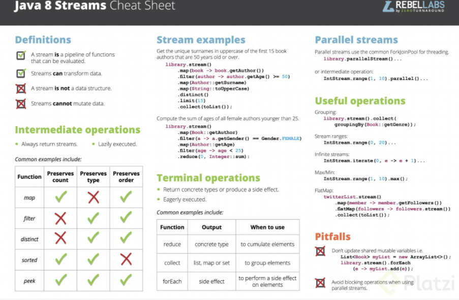

# PROGRAMACIÓN FUNCIONAL

## INTRODUCCIÓN A LA PROGRAMACIÓN FUNCIONAL

### ¿Qué es a programación funcional?

- Es un paradigma de programación, una forma de programar un estilo de programación.
- Es un estilo enfocado en tener casos específicos en el cuál nos preocupamos por ¿qué resolver?

> La programación funcional es mucho más que lambdas.

Desde java 8 en adelantes es posible realizar programación funcional en Java 8.

> Se enfoca en **Qué resolver!** no en **Cómo resolverlo!**

Lo importante en la programación funcional es tener una función que pueda solucionar un problema, no importa su
procedencia.

#### Funciones y datos

Entendiendo qué es una función y entendiendo qué tipos de datos hay podemos generar muchas partes de la programación
funcional.

En la parte de los datos es necesario saber que son datos mutables e inmutables, esto es muy importante debido a que nos
da diferentes tipos de funciones según los datos que tengamos.

#### Beneficios

- Legibilidad: las funciones son más explícitas en qué es lo que hacen.
- Testing: es más fácil hacer una prueba de una sola función que resolver todo el sistema.
- Concurrencia: Se pueden liberar procesos simultaneos a partir de la misma función.
- Comportamientos más definidos: los comportamientos estarán dados por funciones simples.
- Menos manejo de estados: ya no nos preocupamos por qué objeto tiene el valor en el momento en que estamos funcionando.
- No hay que instalar nada adicional: ya es parte del lenguaje.

## ENTENDIENDO LAS PARTES DE LA PROGRAMACIÓN FUNCIONAL

### ¿Qué es una función?

En la programación funcional **una función es un tipo de dato** que puede operar sobre un dato **X** y generar un
dato **Y**.

Idealmente, por cada **X** siempre genera una **Y**.

- Es una serie de pasos parametrizados.
- Puede o no resolver un resultado.
- Se puede definir, almacenar o declarar bajo demanda (como cualquier otro tipo).

### Funciones como ciudadanos de primera clase

Las funciones ahora se vuelven **ciudadanos de primera clase**

- Son algo reconocido por el lenguaje como algo que podemos definir y utilizar.
- Podemos declarar variables de tipo función incluso darles un valor.
- Podemos tomarlas como parámetros de otras funciones o retornarlas como resultado de una ejecución.
- Podemos definirlos bajo demanda.

### Funciones puras

- Es una función que genera el mismo resultado para el mismo parámetro.
- Funcionan en aislamiento, esto quiere decir que no dependen ni las afecta el contexto.
- Son determinas, esto quiere decir que podemos predecir el resultado de la ejecución.
- No genera efectos secuundarrios:
    - No cambia una base de datos.
    - No crea un archivo.
    - No modifica el sistema.

| Función | Puede invocar: pura | Puede invocar: impura |
| ------- | ------------------- | --------------------- |
| Pura    | Sí                  | No                    |
| Impura  | Sí                  | Sí                    |

### Entendiendo los efectos secundarios

Un efecto secundario es todo cambio observale desde fuera del sistema.

- Leer, crear, modificar, borrar archivos.
- Leer, escribir una base de datos.
- Enviar recibir una llamada de red.
- Alterar un objeto/variable usada por otras funciones.

> Los efectos secundarios son inevitables pero podemos reducirlos

#### ¿Por qué queremos evitar los efectos secundarios?

- Nos ayuda a generar una mejor esctructura de nuestro código.
- Nos ayuda a generar más funciones puras.
- Nos ayuda a tener mejor separas las funciones y responsabilidades de nuestro código.

La idea es tener código bien estructurado bien separado en el que las responsabilidades están aisladas.

Tener una arquitectura o tener un sistema en el cuál todas las funciones impuras son simplemente para entrada de
información, pero una vez la información está en el sistema, mantener toda esa información entre funciones puras.

### Funciones de orden mayor

Una **función de orden mayor** es una función que cumple con alguna de estas dos características.

- Toma otra función como parámetro.
- Retorna una función como resultado.

#### Ventajas funciones de orden mayor

- Pasar comportamiento.
- Compartir un medio de comunicación (callback).
- Compartir lógica/reglas.

### Funciones lambda

- Parten de un concepto matemático de los años 30 (Alonzo Church).
- Son funciones anónimas: una función que no tiene un nombre.

#### ¿Por qué usarlas?

- Es un comportamiento de uso único.
- Una regla qe sólo se requiere en un lugar.
- Es una función extremadamente simple.
- Una lambda sigue siendo una función.

### Inmutabilidad de los datos

La mayoría de los casos se va a preferir tener datos inmutables.

#### Ventajas Inmutabilidad

- Una vez creado no se puede alterar.
- Facilita crear funciones puras.
- Facilita usar thrads/concurrencia.

#### Desventajas

- Nueva instancia por cada set e modificaciones.
- requiere especial atención al diseño.
- Objetos mutables fuera de nuestro alcance.

## PROGRAMACIÓN FUNCIONAL EN JAVA

### Paquete java.util.function: Function

Con este paquete es posible crear funciones como tipos de datos que puede ser paasadas como parámetro o retornadas.

```java
public class MathFunctions {

    public static void main(String[] args) {
        Function<Integer, Integer> square = new Function<Integer, Integer>() {
            @Override
            public Integer apply(Integer x) {
                return x * x;
            }
        };

        System.out.println(square.apply(5));
        System.out.println(square.apply(25));

        Function<Integer, Boolean> isOdd = x -> x % 2 == 1;
    }
}
```

### Paquete java.util.predicate: Predicate

La interfaz **predicate** es una especie de función que trabaja sobre un tipo pero genera un boolean. lo que hace es
testear si algo es válido.

```java
public class MathFunctions {

    public static void main(String[] args) {
        Predicate<Integer> isEven = x -> x % 2 == 0;
        System.out.println(isEven.test(4));
    }

}
```

### Paquete java.util.function: Consumer y Supplier

Estas interfaces están definidas para consumir o para proveer datos.

Consumer: Es una expresion lambda que acepta un solo valor y no devuelven valor alguno. Ejemplo: Una función que reciba
una lista de archivos y borre cada uno de ellos, sin devolver nada.

Supplier: Es una expresion que no tienen parámetros pero devuelven un resultado. Ejemplo: Se crea un supplier de tipo
CLIArguments llamado generator que no recibe ni un parametro pero que crea un nuevo objeto CLIArguments y retorna
generator, Se pueden crear archivos bajo demanda.

```java
public class CLIArgumentsUtils {

    static void showHelp(CLIArguments cliArguments) {
        Consumer<CLIArguments> consumerHelper = cliArguments1 -> {
            if (cliArguments1.isHelp()) {
                System.out.println("Manual solicitado");
            }
        };

        consumerHelper.accept(cliArguments);
    }

    static CLIArguments generateCLI() {
        Supplier<CLIArguments> generator = () -> new CLIArguments();
        return generator.get();
    }
}
```

### Paquete java.util.function: Operators y BiFunction

Estas funciones extienden de Function. Quiere decir que tienen el método apply.

- UnaryOperator: Se especifica un solo tipo de dato. Se entiende que tendrá como resultado el mismo tipo.
- BinaryOperator: Solo se especifica un tipo de dato. Se entiende que tendrá 2 parámetros de entrada y uno de retorno
  del mismo tipo de dato.
- BiFunction: 2 parámetros de entrada, se tiene que especificar el tipo de dato. Puede tener diferentes tipos de
  entradas como también diferente tipo de salida.

```java
public class StringFunctions {

    public static void main(String[] args) {
        UnaryOperator<String> quote = text -> "\"" + text + "\"";
        UnaryOperator<String> addMark = text -> text + "!";
        System.out.println(quote.apply("Hola estudiante de Platzi"));
        System.out.println(addMark.apply("Hola"));

        BiFunction<Integer, Integer, Integer> plus = (x, y) -> x * y;
        System.out.println(plus.apply(5, 4));

        BinaryOperator<Integer> plusOp = (x, y) -> x * y;
        System.out.println(plusOp.apply(5, 4));

        BiFunction<String, Integer, String> leftPad = (text, number) -> String.format("%" + number + "s", text);
        System.out.println(leftPad.apply("Java", 10));

        List<BiFunction<String, Integer, String>> formateadores = new ArrayList<>();
    }
}
```

### Entendiendo dos jugadores clave: SAM y FunctionalInterface

- SAM es la abreviación de __Single Abstract Method__, representa a una interfaz que tiene un solo método sin definir.
- Una __Function Interface__ es una interfaz funcional que contiene solo un método abstracto. Solo pueden tener una
  funcionalidad para exhibir. Desde Java 8 en adelante, las expresiones lambda se pueden usar para representar la
  instancia de una interfaz funcional. Una interfaz funcional puede tener varios métodos predeterminados. Runnable,
  ActionListener, Comparable son algunos de los ejemplos de interfaces funcionales. Antes de Java 8, teníamos que crear
  objetos de clase interna anónimos o implementar estas interfaces.
- La anotación __@FunctionalInterface__ es usada para asegurarse que la interfaz funcional no pueda tener más de un
  método abstracto. En caso de que haya más de un método abstracto el compilador mostrar un mensaje de error
  de `Unexpected @FunctionalInterface annotation`. Sin embargo, no es obligatorio usar esta anotación.

```java
public class AgeUtils {

    @FunctionalInterface
    interface TriFunction<T, U, V, R> {
        R apply(T t, U u, V v);
    }

    public static void main(String[] args) {

        Function<Integer, String> addZeros = x -> x < 10 ? "0" + x : String.valueOf(x);

        TriFunction<Integer, Integer, Integer, LocalDate> parseDateStr = (day, month, year) -> LocalDate.parse(year + "-" + addZeros.apply(month) + "-" + addZeros.apply(day));
        System.out.println(parseDateStr.apply(12, 3, 2021));

        TriFunction<Integer, Integer, Integer, LocalDate> parseDate = (day, month, year) -> LocalDate.of(year, month, day);
        System.out.println(parseDate.apply(12, 3, 2021));

        TriFunction<Integer, Integer, Integer, Integer> calculateAge = (day, month, year) -> Period.between(parseDate.apply(day, month, year), LocalDate.now()).getYears();
        System.out.println(calculateAge.apply(10, 6, 1994));

        TriFunction<Integer, Integer, Integer, Integer> calculateAgeStr = (day, month, year) -> Period.between(parseDateStr.apply(day, month, year), LocalDate.now()).getYears();
        System.out.println(calculateAge.apply(10, 6, 1994));

    }

}
```

### Operador de Referencia

El operador de dos puntos **::**, también conocido como operador de referencia de método en Java, se usa para llamar a
un método refiriéndose a él con la ayuda de su clase directamente. Se comportan exactamente como las expresiones lambda.
La única diferencia que tiene de las expresiones lambda es que usa una referencia directa al método por su nombre en
lugar de proporcionar un delegado al método.

La referencia de método o el operador de dos puntos dobles se pueden utilizar para hacer referencia:

- Un método estático: `ClassName :: methodName`
- Un método de instancia: `objectOfClass :: methodName`
- Un constructor: `super :: methodName`

```java
public class NombresUtils {
    static <T> List<T> getList(T... elements) {
        return Arrays.asList(elements);
    }

    public static void main(String[] args) {
        List<String> profesores = getList("Nicolás", "Juan", "Aaron");
        Consumer<String> printer = text -> System.out.println(text);
        profesores.forEach(printer);

        System.out.println("///////////////");
        profesores.forEach(nombre -> System.out.println(nombre));

        System.out.println("///////////////");
        profesores.forEach(System.out::println);

    }
}
```

### Comprendiendo la sintaxis de las funciones lambda

Las expresiones lambda son funciones anónimas, es decir, funciones que no necesitan una clase.

```java
public class Sintaxis {

    @FunctionalInterface
    interface ZeroArguments {
        int get();
    }

    @FunctionalInterface
    interface Nada {
        void nada();
    }

    static void usarZero(ZeroArguments zeroArguments) {

    }

    static void usarPredicado(Predicate<String> predicado) {

    }

    static void usarBiFunction(BiFunction<Integer, Integer, Integer> operacion) {

    }

    static void usarNada(Nada nada) {

    }

    public static void main(String[] args) {
        List<String> cursos = NombresUtils.getList("Java", "Functional");
        cursos.forEach(curso -> System.out.println(curso));

        BiFunction<Integer, Integer, Integer> s = (x, y) -> x * y;

        usarZero(() -> 2);

        usarPredicado(text -> text.isEmpty());

        usarBiFunction((x, y) -> x * y);

        usarBiFunction((x, y) -> {
            System.out.println("X: " + x + ", Y" + y);
            return x - y;
        });

        usarNada(() -> {
            System.out.println("Hola almuno");
        });

        usarBiFunction((Integer x, Integer y) -> x * y);

    }

}
```

### Usando métodos default en nuestras interfaces

Estos métodos, al igual que todos los demás en las interfaces, son de manera implícita públicos. Su principal diferencia
es que no son abstractos como el resto y necesitan proporcionar una implementación para pasar la fase de compilación.

```java
public class TextFunctions {

    @FunctionalInterface
    interface StringOperation {
        int getAmount();

        default void operate(String text) {
            int x = getAmount();
            while (x-- > 0) {
                System.out.println(text);
            }
        }
    }

    @FunctionalInterface
    interface DoOperation {
        void take(String text);

        default void execute(int x, String text) {
            while (x-- > 0) {
                take(text);
            }
        }

        default void test(int x, String text) {
            while (x-- > 0) {
                take(text);
            }
        }
    }

    public static void main(String[] args) {
        StringOperation six = () -> 6;

        System.out.println(six.getAmount());
        six.operate("Hello");

        DoOperation operateFive = text -> System.out.println(text);
        operateFive.execute(5, "Platzi");
    }
}
```

### Chaining

Encadenar el resultado de una ejecución con respecto a otra ejecución.

```java
public class Chaining {

    static class Chainer {

        public Chainer sayHi() {
            System.out.println("Hola");
            return this;
        }

        public Chainer sayBye() {
            System.out.println("Adiós");
            return this;
        }

    }

    public static void main(String[] args) {
        StringBuilder stringBuilder = new StringBuilder();
        stringBuilder
                .append("Hola")
                .append("alumno")
                .append("de")
                .append("platzi");

        Chainer chainer = new Chainer();
        Chainer chainer1 = chainer.sayHi();
        Chainer chainer2 = chainer.sayBye();
    }
}
```

### Composición de funciones

La diferencia entre **compose** y **andThen** es el orden en que ejecutan las funciones. Mientras que la función **
compose** ejecuta el llamado en último lugar y el parámetro primero, **andThen** ejecuta el llamado primero y el
parámetro en último lugar.

- compose: Permite agregar pasos antes de la ejecución de una función( La lambda se ejecuta antes de la función que
  llama a compose)
- andThen: Permite agregar pasos después de la ejecución de una función( La lambda se ejecuta después de la función que
  llama a andThen)

```java
public class MathOperations2 {

    public static void main(String[] args) {
        Function<Integer, Integer> multuplyBy3 = x -> {
            System.out.println("Multiplicando x: " + x + " por 3");
            return x * 3;
        };

        Function<Integer, Integer> add1MultiplyBy3 = multuplyBy3.compose(y -> {
            System.out.println("Le agregamos 1 a: " + y);
            return y + 1;
        });

        Function<Integer, Integer> andSquare = add1MultiplyBy3.andThen(x -> {
            System.out.println("Estoy elevando " + x + " al cuadrado");
            return x * x;
        });

        System.out.println(add1MultiplyBy3.apply(5));
        System.out.println(andSquare.apply(3));

    }
}
```

Resultado:

```text
Le agregamos 1 a: 5
Multiplicando x: 6 por 3
18
Le agregamos 1 a: 3
Multiplicando x: 4 por 3
Estoy elevando 12 al cuadrado
144
```

## Optional y Streams

### La clase Optional

Esta clase nos ayuda a evitar problemas con valores inexistentes, es decir evita tener **nullPointerException**.

```java
public class Optionals {
    static Optional<List<String>> getOptionalNames() {
        List<String> namesList = new LinkedList<>();
        // Obtencion de nombres
        return Optional.of(namesList);
    }

    static Optional<String> optionalValuablePlayer() {
//        Retornar un dato del cual desconocemos si es null o no
//        return Optional.ofNullable();
        try {
            return Optional.of("Aaron");
        } catch (Exception e) {
            e.printStackTrace();
        }
        return Optional.empty();
    }

    public static void main(String[] args) {
        Optional<List<String>> optionalNames = getOptionalNames();
        if (optionalNames.isPresent()) {

        }
        optionalNames.ifPresent(namesValue -> namesValue.forEach(System.out::println));

        Optional<String> optionalValuablePlayer = optionalValuablePlayer();
        String valuablePlayerName = optionalValuablePlayer.orElseGet(() -> "No player");
    }
}
```

### Streams

Cuando queremos operar sobre multiples datos, la clase **stream** es una especie de lista que tiene elementos y se
pueden iterar. La diferencia esencial entre listas, colecciones y streams es que un **stream** es **auto iterable**.

Es importante tener en cuenta que un **Stream** solo puede ser consumido una vez. Cuando un stream realiza una operación
genera un nuevo stream y el nuevo stream es el que debe consumir, el original ya no puede consumirse ni operarse.

### ¿Qué son los Stream listeners?

Los **stream** tiene dos tipos de operaciones:

1. Operaciones intermedias:
   Genera un nuevo Stream del tipo según sea la operación.
2. Operaciones terminales:
   Genera un dato final después de haber operado todo.

#### Operaciones Intermedias:

- **map**: el método de **map** se utiliza para devolver una secuencia que consta de los resultados de aplicar la
  función dada a los elementos de esta secuencia.

```java
public class Streams {
    public static void main(String[] args) {
        List number = Arrays.asList(2, 3, 4, 5);
        List square = number.stream().map(x -> x * x).collect(Collectors.toList());
    }
}
```

- **filter**: el método **filter** se utiliza para seleccionar elementos según el predicado pasado como argumento.

```java
public class Streams {
    public static void main(String[] args) {
        List names = Arrays.asList("Reflection", "Collection", "Stream");
        List result = names.stream().filter(s -> s.startsWith("S")).collect(Collectors.toList());
    }
}
```

- **sorted**: el método **sorted** se utiliza para ordenar la secuencia.

```java
public class Streams {
    public static void main(String[] args) {
        List names = Arrays.asList("Reflection", "Collection", "Stream");
        List result = names.stream().filter(s -> s.startsWith("S")).collect(Collectors.toList());
    }
}
```

#### Operaciones Terminales

- **collect**: el método **collect** se utiliza para devolver el resultado de las operaciones intermedias realizadas en
  la secuencia.

```java
public class Streams {
    public static void main(String[] args) {
        List number = Arrays.asList(2, 3, 4, 5, 3);
        Set square = number.stream().map(x -> x * x).collect(Collectors.toSet());

    }
}
```

- **forEach**: el método **forEach** se utiliza para recorrer en iteración todos los elementos de la secuencia.

```java
public class Streams {
    public static void main(String[] args) {
        List number = Arrays.asList(2, 3, 4, 5);
        number.stream().map(x -> x * x).forEach(y -> System.out.println(y));
    }
}
```

- **reduce**: el método de **reduce** se utiliza para reducir los elementos de una secuencia a un solo valor. El método
  reduce toma un BinaryOperator como parámetro.

```java
public class Streams {
    public static void main(String[] args) {
        List number = Arrays.asList(2, 3, 4, 5);
        int even = number.stream().filter(x -> x % 2 == 0).reduce(0, (ans, i) -> ans + i);
    }
}
```



#### Operaciones y Collectors

Usando **Stream** nos podemos simplificar algunas operaciones, como es el **filtrado**, el **mapeo**, **conversiones** y
más. Sin embargo, no es del todo claro cuándo una operación nos devuelve otro Stream para trabajar y cuándo nos da un
resultado final…

¡O al menos no era claro hasta ahora!

Cuando hablamos de pasar lambdas a una operación de Stream, en realidad, estamos delegando a Java la creación de un
objeto basado en una interfaz.

Por ejemplo:

```java
public class Streams {
    public static void main(String[] args) {
        Stream<String> coursesStream = Utils.getListOf("Java", "Node.js", "Kotlin").stream();
        Stream<String> javaCoursesStream = coursesStream.filter(course -> course.contains("Java"));
        // En realidad, es lo mismo que:
        Stream<String> explicitOperationStream = coursesStream.filter(new Predicate<String>() {
            public boolean test(String st) {
                return st.contains("Java");
            }
        });
    }
}
```

- `Consumer<T>`: recibe un dato de tipo T y no genera ningún resultado
- `Function<T,R>`: toma un dato de tipo T y genera un resultado de tipo R
- `Predicate<T>`: toma un dato de tipo T y evalúa si el dato cumple una condición
- `Supplier<T>`: no recibe ningún dato, pero genera un dato de tipo T cada vez que es invocado
- `UnaryOperator<T>` recibe un dato de tipo T y genera un resultado de tipo T

Estas interfaces (y otras más) sirven como la base de donde generar los objetos con las lambdas que pasamos a los
diferentes métodos de Stream. Cada una de ellas cumple esencialmente con recibir el tipo de dato del Stream y generar el
tipo de retorno que el método espera.

Si tuvieras tu propia implementación de Stream, se vería similar al siguiente ejemplo:

```java
public class PlatziStream<T> implements Stream {
    private List<T> data;

    public Stream<T> filter(Predicate<T> predicate) {
        List<T> filteredData = new LinkedList<>();
        for (T t : data) {
            if (predicate.test(t)) {
                filteredData.add(t);
            }
        }

        return filteredData.stream();
    }
}
```

Probablemente, tendría otros métodos y estructuras de datos, pero la parte que importa es justamente cómo se usa el
Predicate. Lo que hace Stream internamente es pasar cada dato por este objeto que nosotros proveemos como una lambda y,
según el resultado de la operación, decidir si debe incluirse o no en el Stream resultante.

Como puedes notar, esto no tiene mucha complejidad, puesto que es algo que pudimos fácilmente replicar. Pero Stream no
solo incluye estas operaciones “triviales”, también incluye un montón de utilidades para que la máquina virtual de Java
pueda operar los elementos de un Stream de manera más rápida y distribuida.

#### Operaciones

A estas funciones que reciben lambdas y se encargan de trabajar (operar) sobre los datos de un Stream generalmente se
les conoce como Operaciones.

Existen dos tipos de operaciones: **intermedias** y **finales**.

Cada operación aplicada a un Stream hace que el Stream original ya no sea usable para más operaciones. Es importante
recordar esto, pues tratar de agregar operaciones a un Stream que ya esta siendo procesado es un error muy común.

En este punto seguramente te parezcan familiares todas estas operaciones, pues vienen en forma de métodos de la interfaz
Stream. Y es cierto. Aunque son métodos, se les considera operaciones, puesto que su intención es operar el Stream y,
posterior a su trabajo, el Stream no puede volver a ser operado.

#### Collectors

Una vez que has agregado operaciones a tu Stream de datos, lo más usual es que llegues a un punto donde ya no puedas
trabajar con un Stream y necesites enviar tus datos en otro formato, por ejemplo, JSON o una List a base de datos.

Existe una interfaz única que combina todas las interfaces antes mencionadas y que tiene como única utilidad proveer de
una operación para obtener todos los elementos de un Stream: **Collector**.

`Collector<T, A, R>` es una interfaz que tomará datos de tipo T del Stream, un tipo de dato mutable A, donde se iran
agregando los elementos (mutable implica que podemos cambiar su contenido, como un LinkedList), y generara un resultado
de tipo R.

Suena complicado… y lo es. Por eso mismo, Java 8 incluye una serie de Collectors ya definidos para no rompernos la
cabeza con cómo convertir nuestros datos.

Veamos un ejemplo:

```java
public class PlatziStream {
    public List<String> getJavaCourses(Stream<String> coursesStream) {
        List<String> javaCourses =
                coursesStream.filter(course -> course.contains("Java"))
                        .collect(Collectors.toList());

        return javaCourses;
    }
}
```

Usando java.util.stream.Collectors podemos convertir muy sencillamente un Stream en un Set, Map, List, Collection, etc.
La clase Collectors ya cuenta con métodos para generar un Collector que corresponda con el tipo de dato que tu Stream
está usando. Incluso vale la pena resaltar que Collectors puede generar un ConcurrentMap que puede ser de utilidad si
requieres de multiples threads.

Usar Collectors.toXXX es el proceso inverso de usar Collection.stream(). Esto hace que sea fácil generar APIs publicas
que trabajen con estructuras/colecciones comunes e internamente utilizar Stream para agilizar las operaciones de nuestro
lado.

#### Tipos de retorno

Hasta este punto, la única manera de obtener un dato que ya no sea un Stream es usando Collectors, pues la mayoría de
operaciones de Stream se enfocan en operar los datos del Stream y generar un nuevo Stream con los resultados de la
operación.

Sin embargo, algunas operaciones no cuentan con un retorno. Por ejemplo, forEach, que es una operación que no genera
ningún dato. Para poder entender qué hace cada operación basta con plantear qué hace la operación para poder entender
qué puede o no retornar.

Por ejemplo:

> La operación de **findAny** trata de encontrar cualquier elemento que cumpla con la condición del **Predicate** que le pasamos como parámetro. Sin embargo, la operación dice que se devuelve un **Optional**. ¿Qué pasa cuando no encuentra ningún elemento? ¡Claro, por eso devuelve un Optional! Porque podría haber casos en que ningún elemento del Stream cumpla la condición.

#### Conclusiones

Por ahora, hemos entendido que cada operación en un Stream consume hasta agotar el Stream. Y lo hace en un objeto no
reusable. Esto implica que tenemos que decidir en nuestro código cuándo un Stream es un elemento temporal para una
función o cuándo realmente una función sera la última en tocar los datos del Stream.

### Streams de tipo específico y Paralelismo

La computación paralela implica dividir un problema en subproblemas, resolver esos problemas simultáneamente (en
paralelo, con cada subproblema ejecutándose en un hilo separado) y luego combinar los resultados de las soluciones a los
subproblemas.

Stream trabaja mejor en un solo procesador cuando son pocos datos. Si son bastantes datos como cientos de miles o
millones es recomendable usar **parallel**; si el orden de los datos importa no se debería usar parallel.

#### ¿Cuándo utilizar Parallel Streams?

1. Deben usarse cuando no se necesita que el resultado de la operación dependa del orden de los elementos presentes en
   la colección de origen (es decir, en el que se crea la secuencia)
2. Los flujos paralelos se pueden utilizar en el caso de funciones agregadas
3. Los flujos paralelos iteran rápidamente sobre las colecciones de gran tamaño
4. Se pueden usar secuencias paralelas si los desarrolladores tienen implicaciones de rendimiento con las secuencias
   secuenciales
5. Si el entorno no es multiproceso, Parallel Stream crea un hilo y puede afectar las nuevas solicitudes que ingresan.

```java
public class TypeStream {

    public static void main(String[] args) {
        long current = System.currentTimeMillis();
        infiniteStream = IntStream.iterate(0, x -> x + 1);
        infiniteStream.limit(1000)
                .parallel()
                .filter(x -> x % 2 == 0)
                .forEach(System.out::println);
    }
}
```

### Operaciones Terminales

Las operaciones terminales son aquellas operaciones que como resultado no generan un nuevo Stream. Su resultado puede
variar según la operación. La utilidad de estas es poder generar un valor final a todas nuestras operaciones o consumir
los datos finales. La razón principal para querer esto es que los datos deberán salir en algún punto de nuestro control
y es con las operaciones terminales que hacemos esto.

Las operaciones terminales más comunes que se encuentran en Stream son:

- anyMatch()
- allMatch()
- noneMatch()
- findAny()
- findFirst()
- min()
- max()
- reduce()
- count()
- toArray()
- collect()
- forEach()

#### Operaciones terminales de coincidencia

**anyMatch, allMatch, noneMatch**

Las operaciones anyMatch, allMatch y noneMatch sirven para determinar si en un Stream hay elementos que cumplan con un
cierto Predicate. Esto puede ser una forma simple de validar los datos de un Stream. Son terminales pues las tres
retornan un boolean:

```java
public class TypeStream {
    public static void main(String[] args) {
        //Nos indica si un stream contiene un elemento según el Predicate que le pasemos:
        Stream numbersStream = Stream.of(1, 2, 3, 4, 5, 6, 7, 11);
        boolean biggerThanTen = numbersStream.anyMatch(i -> i > 10); //true porque tenemos el 11

        //allMatch
        //Nos indica si todos los elementos de un Stream cumplen con un cierto Predicate:
        Stream agesStream = Stream.of(19, 21, 35, 45, 12);
        boolean allLegalDrinkingAge = agesStream.allMatch(age -> age > 18); //false, tenemos un menor

        //noneMatch
        //Nos indica si todos los elementos de un Stream NO CUMPLEN un cierto Predicate:
        Stream oddNumbers = Stream.of(1, 3, 5, 7, 9, 11);
        boolean allAreOdd = oddNumbers.noneMatch(i -> i % 2 == 0);
    }
}
```

#### Operaciones terminales de búsqueda

**findAny, findFirst**

Estas operaciones retornan un Optional como resultado de buscar un elemento dentro del Stream.

La diferencia entre ambas es que findFirst retornara un Optional conteniendo el primer elemento en el Stream si el Stream tiene definida previamente una operación de ordenamiento o para encontrar elementos. De lo contrario, funcionará igual que findAny, tratando de devolver cualquier elemento presente en el Stream de forma no determinista (random).

Si el elemento encontrado es null, tendrás que lidiar con una molesta NullPointerException. Si el Stream esta vacío, el retorno es equivalente a Optional.empty().

La principal razón para usar estas operaciones es poder usar los elementos de un Stream después haber filtrado y convertido tipos de datos. Con Optional nos aseguramos que, aún si no hubiera resultados, podremos seguir trabajando sin excepciones o escribiendo condicionales para validar los datos.

#### Operaciones terminales de reducción

**min, max**

Son dos operaciones cuya finalidad es obtener el elemento más pequeño (min) o el elemento más grande (max) de un Stream usando un Comparator. Puede haber casos de Stream vacíos, es por ello que las dos operaciones retornan un Optional para en esos casos poder usar Optional.empty.

La interfaz **Comparator** es una `@FunctionalInterface`, por lo que es sencillo usar min y max con lambdas:

```java
public class TypeStream {
    public static void main(String[] args) {
        Stream bigNumbers = Stream.of(100L, 200L, 1000L, 5L);
        Optional minimumOptional = bigNumbers.min((numberX, numberY) -> (int) Math.min(numberX, numberY));
    }
}
```

**reduce**

Esta operación existe en tres formas:

- `reduce(BinaryOperator)`
- `reduce(valorInicial, BinaryOperator)`
- `reduce(valorInicial, BinaryFunction, BinaryOperator)`

La diferencia entre los 3 tipos de invocación:

**reduce(BinaryOperator)**

Retorna un Optional del mismo tipo que el Stream, con un solo valor resultante de aplicar el BinaryAccumulator sobre cada elemento o Optional.empty() si el stream estaba vacío. Puede generar un NullPointerException en casos donde el resultado de BinaryAccumulator sea null.

```java
public class TypeStream {
    public static void main(String[] args) {
        Stream aLongStoryStream = Stream.of("Cuando", "despertó,", "el", "dinosaurio", "todavía", "estaba", "allí.");
        BinaryOperator<String> acumulator = (text1, text2) -> text1 + " " + text2;
        Optional<String> stringOptional = aLongStoryStream.reduce(acumulator);
        stringOptional.ifPresent(System.out::println);
        // "Cuando despertó, el dinosaurio todavía estaba allí."
    }
}
```

**reduce(valorInicial, BinaryOperator)**

Retorna un valor del mismo tipo que el Stream después de aplicar BinaryOperator sobre cada elemento del Stream. En caso de un Stream vacío, el valorInicial es retornado.

```java
public class TypeStream {
    public static void main(String[] args) {
        Stream<Integer> firstTenNumbersStream = Stream.iterate(0, i -> i + 1).limit(10);
        BinaryOperator<Integer> operatorSum = Integer::sum;
        int sumOfFirstTen = firstTenNumbersStream.reduce(0, operatorSum);
        System.out.println(sumOfFirstTen);
        //45 -> 0 + 1 + … + 9
    }
}
```

**reduce(valorInicial, BinaryFunction, BinaryOperator)**

Genera un valor de tipo `V` después de aplicar `BinaryFunction` sobre cada elemento de tipo `T` en el `Stream` y obtener un resultado `V`.

Esta version de `reduce` usa el `BinaryFunction` como `map + reduce`. Es decir, por cada elemento en el `Stream` se genera un valor `V` basado en el valorInicial y el resultado anterior de la `BinaryFunction`. `BinaryOperator` se utiliza en `streams` paralelos `(stream.parallel())` para determinar el valor que se debe mantener en cada iteración.

```java
public class TypeStream {
    public static void main(String[] args) {
        Stream<String> aLongStoryStreamAgain = Stream.of("Cuando", "despertó,", "el", "dinosaurio", "todavía", "estaba", "allí.");
        BiFunction<Integer, String, Integer> countBiFunction = (count, word) -> count + word.length();
        BinaryOperator<Integer> sumResult = Integer::sum;
        int charCount = aLongStoryStreamAgain.parallel().reduce(0, countBiFunction, sumResult);
        System.out.println(charCount);
        //48 -> puede ser usado sin parallel
    }
}
```

**count**

Una operación sencilla: sirve para obtener cuantos elementos hay en el Stream.

```java
public class TypeStream {
    public static void main(String[] args) {
        Stream<Integer> yearsStream = Stream.of(1990, 1991, 1994, 2000, 2010, 2019, 2020);
        long yearsCount = yearsStream.count();
        System.out.println(yearsCount);
        // 7, solo nos dice cuantos datos tuvo el stream.
    }
}
```

La principal razón de usar esta operación es que, al aplicar filter o flatMap, nuestro Stream puede crecer o disminuir de tamaño y, tal vez, de muchas operaciones solo nos interese saber cuántos elementos quedaron presentes en el Stream. Por ejemplo, cuantos archivos se borraron o cuantos se crearon por ejemplo.

**toArray**

Agrega todos los elementos del `Stream` a un arreglo y nos retorna dicho arreglo. La operación genera un `Object[]`, pero es posible hacer castings al tipo de dato del Stream.

**collect**

Collector es una interfaz que tomara datos de tipo T del Stream, un tipo de dato mutable A, donde se irán agregando los elementos (mutable implica que podemos cambiar su contenido, como un LinkedList) y generara un resultado de tipo R.
Usando java.util.stream.Collectors podemos convertir sencillamente un Stream en un Set, Map, List, Collection, etc. La clase Collectors ya cuenta con métodos para generar un Collector que corresponda con el tipo de dato que tu Stream esta usando. Incluso vale la pena resaltar que Collectors puede generar un ConcurrentMap que puede ser de utilidad si requieres de multiples threads.

```java
public class TypeStream {
    public List getJavaCourses(Stream coursesStream) {
        List javaCourses = coursesStream.filter(course -> course.contains("Java"))
                        .collect(Collectors.toList());

        return javaCourses;
    }
}
```

#### Operaciones terminales de iteración

**forEach**

Tan simple y tan lindo como un clásico for. forEach es una operación que recibe un Consumer y no tiene un valor de retorno (void). La principal utilidad de esta operación es dar un uso final a los elementos del Stream.

```java
public class TypeStream {
    public static void main(String[] args) {
        Stream courses = getCourses();
        courses.forEach(courseList -> System.out.println("Cursos disponibles: " + courseList));
    }
}
```

#### Conclusiones

Las operaciones terminales se encargan de dar un fin y liberar el espacio usado por un Stream. Son también la manera de romper los encadenamientos de métodos entre streams y regresar a nuestro código a un punto de ejecución lineal. Como su nombre lo indica, por lo general, son la última operación presente cuando escribes chaining:

```java
public class TypeStream {
    public static void main(String[] args) {
        Stream infiniteStream = Stream.iterate(0, x -> x + 1);
        List numbersList = infiniteStream.limit(1000)
                .filter(x -> x % 2 == 0)        // Operación intermedia
                .map(x -> x * 3)                // Operación intermedia
                .collect(Collectors.toList());  // Operación final
    }
}
```

Por último, recuerda que una vez que has agregado una operación a un Stream, el Stream original ya no puede ser utilizado. Y más aun al agregar una operación terminal, pues esta ya no crea un nuevo Stream. Internamente, al recibir una operación, el Stream en algún punto llama a su método close, que se encarga de liberar los datos y la memoria del Stream.

### Operaciones Intermedias

Se le dice operación intermedia a toda operación dentro de un Stream que como resultado devuelva un nuevo Stream. Es decir, tras invocar una operación intermedia con un cierto tipo de dato, obtendremos como resultado un nuevo Stream conteniendo los datos ya modificados.

El Stream que recibe la operación intermedia pasa a ser “consumido” posterior a la invocación de la operación, quedando inutilizable para posteriores operaciones. Si decidimos usar el Stream para algún otro tipo de operaciones tendremos un `IllegalStateException`.

```java
public class OperadoresIntermedios {
    public static void main(String[] args) {
        tream initialCourses = Stream.of("Java", "Spring", "Node.js");

        Stream lettersOnCourses = initialCourses.map(course -> course.length());
        //De este punto en adelante, initialCourses ya no puede agregar mas operaciones.

        Stream evenLengthCourses = lettersOnCourses.filter(courseLength -> courseLength % 2 == 0);
        //lettersOnCourses se consume en este punto y ya no puede agregar mas operaciones. No es posible usar el Stream mas que como referencia.
    }
}
```

El ejemplo anterior puede ser reescrito usando chaining. Sin embargo, la utilidad de este ejemplo es demostrar que las operaciones intermedias generan un nuevo Stream.

#### Operaciones disponibles

La interfaz Stream cuenta con un grupo de operaciones intermedias. A lo largo de esta lectura explicaremos cada una de ellas y trataremos de aproximar su funcionalidad. Cada operación tiene implementaciones distintas según la implementación de Stream, en nuestro caso, haremos solo aproximaciones de la lógica que sigue la operación.

Las operaciones que ya están definidas son:

- `filter(…)`
- `map(…)`
- `flatMap(…)`
- `distinct(…)`
- `limit(…)`
- `peek(…)`
- `skip(…)`
- `sorted(…)`

Analicemos qué hace cada una de ellas y hagamos código que se aproxime a lo que hacen internamente.

**filter**

La operación de filtrado de Stream tiene la siguiente forma:

> Stream filter(Predicate<super T> predicate)

Algunas cosas que podemos deducir únicamente viendo los elementos de la operación son:

- La operación trabaja sobre un Stream y nos devuelve un nuevo Stream del mismo tipo (T).
- Sin embargo, el Predicate que recibe como parámetro trabaja con elementos de tipo T y cualquier elemento siempre que sea un subtipo de T. Esto quiere decir que si tenemos la clase PlatziStudent extends Student y tenemos un Stream donde también tenemos elementos de tipo PlatziStudent, podemos filtrarlos sin tener que revisar o aclarar el tipo
- Predicate es una @FunctionalInterface, lo cual nos permite pasar como parámetro objetos que implementen esta interfaz o lambdas

```java
public class OperadoresIntermedios {
    public Stream getJavaCourses(List courses){
        return courses.stream() .filter(course -> course.contains("Java"));
    }
}
```

Lo interesante radica en la condición que usamos en nuestra lambda, con ella determinamos si un elemento debe permanecer o no en el Stream resultante. En la lectura anterior hicimos una aproximación de la operación filter:

```java
public class OperadoresIntermedios {
    public Stream filter(Predicate predicate) {
        List filteredData = new LinkedList<>();
        for(T t : this.data){
            if(predicate.test(t)){
                filteredData.add(t);
            }
        }

        return filteredData.stream();
    }
}
```

filter se encarga de iterar cada elemento del Stream y evaluar con el Predicate si el elemento debe estar o no en el Stream resultante. Si nuestro Predicate es sencillo y no incluye ningún ciclo o llamadas a otras funciones que puedan tener ciclos, la complejidad del tiempo es de O(n), lo cual hace que el filtrado sea bastante rápido.

Usos comunes de filter es limpiar un Stream de datos que no cumplan un cierto criterio. Como ejemplo podrías pensar en un Stream de transacciones bancarias, mantener el Stream solo aquellas que superen un cierto monto para mandarlas a auditoria, de un grupo de calificaciones de alumnos filtrar únicamente por aquellos que aprobaron con una calificación superior a 6, de un grupo de objetos JSON conservar aquellos que tengan una propiedad en especifico, etc.

Entre mas sencilla sea la condición de filtrado, más legible sera el código. Te recomiendo que, si tienes más de una condición de filtrado, no le temas a usar varias veces filter:

```java
public class OperadoresIntermedios {
    public static void main(String[] args) {
        courses.filter(course -> course.getName().contains("Java"))
                .filter(course -> course.getDuration() > 2.5)
                .filter(course -> course.getInstructor().getName() == Instructors.SINUHE_JAIME);
    }
}
```

Tu código sera más legible y las razones de por qué estás aplicando cada filtro tendrán más sentido. Como algo adicional podrías mover esta lógica a funciones individuales en caso de que quieras hacer más legible el código, tener más facilidad de escribir pruebas o utilices en más de un lugar la misma lógica para algunas lambdas:

```java
public class OperadoresIntermedios {
    public static void main(String[] args) {
        courses.filter(Predicates::isAJavaCourse)
                .filter(Predicates::hasEnoughDuration)
                .filter(Predicates::hasSinuheAsInstructor);

        // La lógica es la misma:
        public final class Predicates {
            public static final boolean isAJavaCourse(Course course){
                return course.getName().contains("Java");
            }
        }
    }
}
```

**map**

La operación map puede parecer complicada en un principio e incluso confusa si estas acostumbrado a usar Map, pero cabe resaltar que no hay relación entre la estructura y la operación. La operación es meramente una transformación de un tipo a otro.

> Stream map(Function <super T, ? extends R> mapper)

Los detalles a resaltar son muy similares a los de filter, pero la diferencia clave está en T y R. Estos generics nos dicen que map va a tomar un tipo de dato T, cualquiera que sea, le aplicara la función mapper y generara un R.

Es algo similar a lo que hacías en la secundaria al convertir en una tabla datos, para cada x aplicabas una operación y obtenías una y (algunos llaman a esto tabular). map operará sobre cada elemento en el Stream inicial aplicando la Function que le pases como lambda para generar un nuevo elemento y hacerlo parte del Stream resultante:

> Stream ids = DatabaseUtils.getIds().stream();
> Stream users = ids.map(id -> db.getUserWithId(id));

O, puesto de otra forma, por cada DatabaseID en el Stream inicial, al aplicar map genera un User:

- DatabaseID(1234) -> map(…) -> User(Sinuhe Jaime, @Sierisimo)
- DatabaseID(4321) -> map(…) -> User(Diego de Granda, @degranda10)
- DatabaseID(007) -> map(…) ->User(Oscar Barajas, @gndx)

Esto resulta bastante practico cuando queremos hacer alguna conversión de datos y realmente no nos interesa el dato completo (solo partes de él) o si queremos convertir a un dato complejo partiendo de un dato base.

Si quisiéramos replicar qué hace internamente map sería relativamente sencillo:

```java
public class OperadoresIntermedios {
    public  Stream map(Function mapper) {
        List mappedData = new LinkedList<>();
        for(T t : this.data){
            R r = mapper.apply(t);
            mappedData.add(r);
        }

        return mappedData.stream();
    }
}
```

La operación map parece simple ya vista de esta manera. Sin embargo, por dentro de las diferentes implementaciones de Stream hace varias validaciones y optimizaciones para que la operación pueda ser invocada en paralelo, para prevenir algunos errores de conversión de tipos y hacer que sea mas rápida que nuestra versión con un for.

**flatMap**

En ocasiones no podremos evitar encontrarnos con streams del tipo Stream, donde tenemos datos con muchos datos…

Este tipo de streams es bastante común y puede pasarte por multiples motivos. Se puede tornar difícil operar el Stream inicial si queremos aplicar alguna operación a cada uno de los elementos en cada una de las listas.

En el caso de que mantener la estructura de las listas (o colecciones) no es importante para el procesamiento de los datos que contengan, entonces podemos usar flatMap para simplificar la estructura del Stream, pasándolo de Stream> a Stream.

Visto en un ejemplo más “visual”:

> Stream coursesLists;
> // Stream{List["Java", "Java 8 Functional", "Spring"], List["React", "Angular", "Vue.js"], List["Big Data", "Pandas"]}

> Stream allCourses;
> // Stream{ ["Java", "Java 8 Functional", "Spring", "React", "Angular", "Vue.js", "Big Data", "Pandas"]}

La operación flatMap tiene la siguiente forma:

>  Stream flatMap(Function<super T, ? extends Stream> mapper)

Lo interesante es que el resultado de la función mapper debe ser un Stream. Stream usará el resultado de mapper para “acumular” elementos en un Stream desde otro Stream. Puede sonar confuso, por lo que ejemplificarlo nos ayudará a entenderlo mejor:

```java
//Tenemos esta clase:
public class PlatziStudent {
    private boolean emailSubscribed;
    private List emails;

    public boolean isEmailSubscribed() {
        return emailSubscribed;
    }

    public List getEmails(){
        return new LinkedList<>(emails); //Creamos una copia de la lista para mantener la clase inmutable por seguridad
    }
}

public class OperadoresIntermedios {
    public static void main(String[] args) {
        //Primero obtenemos objetos de tipo usuario registrados en Platzi:
        Stream platziStudents = getPlatziUsers().stream();

        // Despues, queremos enviarle un correo a todos los usuarios pero… solo nos interesa obtener su correo para notificarlos:
        Stream allEmailsToNotify =
                platziStudents.filter(PlatziStudent::isEmailSubscribed) //Primero evitamos enviar correos a quienes no estén subscritos
                        .flatMap(student -> student.getEmails().stream()); // La lambda genera un nuevo Stream de la lista de emails de cada studiante.

        sendMonthlyEmails(allEmailsToNotify);
        //El Stream final solo es un Stream de emails, sin mas detalles ni información adicional.
    }
}
```

La operación flatMap es una manera en la que podemos depurar datos de información adicional que no sea necesaria.

**distinct**

Esta operación es simple:

> Stream distinct()

Lo que hace es comparar cada elemento del Stream contra el resto usando el método equals. De esta manera, evita que el Stream contenga elementos duplicados. La operación, al ser intermedia, retorna un nuevo Stream donde los elementos son únicos. Recuerda que para garantizar esto es recomendable que sobrescribas el método equals en tus clases que representen datos.

**limit**

La operación limit recibe un long que determina cuántos elementos del Stream original seran preservados. Si el número es mayor a la cantidad inicial de elementos en el Stream, básicamente, todos los elementos seguirán en el Stream. Un detalle interesante es que algunas implementaciones de Stream pueden estar ordenadas (sorted()) o explícitamente no ordenadas (unordered()), lo que puede cambiar drásticamente el resultado de la operación y el performance.

> Stream limit(long maxSize)

La operación asegura que los elementos en el Stream resultante serán los primeros en aparecer en el Stream. Es por ello que la operación es ligera cuando el Stream es secuencial o se usó la operación unordered() (no disponible en todos los Streams, ya que la operación pertenece a otra clase).

```java
public class OperacionesIntermedias {

    public static void main(String[] args) {
        List<Integer> names = Stream.iterate(0, i -> i + 1)
                .limit(100)
                .collect(Collectors.toList());

        names.stream()
                .limit(5)
                .forEach(System.out::println);

    }
}
```

**peek**

La operación peek funciona como una lupa, como un momento de observación de lo que está pasando en el Stream. Lo que hace esta operación es tomar un Consumer, pasar los datos conforme van estando presentes en el Stream y generar un nuevo Stream idéntico para poder seguir operando.

La estructura de peek es simple

> Stream peek(Consumersuper T> consumer)

Usarlo puede ayudarnos a generar logs o registros de los datos del Stream, por ejemplo:

```java
public class OperacionesIntermedias {

    public static void main(String[] args) {
        Stream serverConnections =
                server.getConnectionsStream()
                        .peek(connection -> logConnection(connection, new Date()))
                        .filter()
                        .map();
        //Otras operaciones…

    }
}
```

**skip**

Esta operación es contraria a limit(). Mientras limit() reduce los elementos presentes en el Stream a un numero especifico, skip descarta los primeros n elementos y genera un Stream con los elementos restantes en el Stream.

> Stream first10Numbers = Stream.of(0,1,2,3,4,5,6,7,8,9);
> 
> Stream last7Numbers = first10Numbers.skip(3);
> 
> // 3,4,5,6,7,8,9

Esto puede ser de utilidad si sabemos qué parte de la información puede ser descartable. Por ejemplo, descartar la primera línea de un XML (), descartar metadatos de una foto, usuarios de prueba al inicio de una base de datos, el intro de un video, etc.

**sorted**

La operación sorted() requiere que los elementos presentes en el Stream implementen la interfaz Comparable para poder hacer un ordenamiento de manera natural dentro del Stream. El Stream resultante contiene todos los elementos pero ya ordenados, hacer un ordenamiento tiene muchas ventajas, te recomiendo los cursos de algoritmos de Platzi para poder conocer a mas detalle estas ventajas.

#### Conclusiones

Las operaciones intermedias nos permiten tener control sobre los streams y manipular sus contenidos de manera sencilla sin preocuparnos realmente por cómo se realizan los cambios.

Recuerda que las operaciones intermedias tienen la funcionalidad de generar nuevos streams que podremos dar como resultado para que otras partes del código los puedan utilizar.

Aunque existen otras operaciones intermedias en diferentes implementaciones de Stream, las que aquí listamos están presentes en la interfaz base, por lo que entender estas operaciones te facilitara la vida en la mayoría de los usos de Stream.

### Collectors

con collet recogemos esos datos y creamos en una estructura ya fisica o datos en concreto

> boxed() es un metodo de IntStream que convierte el IntStream en un Stream de enteros, es decir, Stream<Integer>

## PROYECTO JOB - SEARCH
